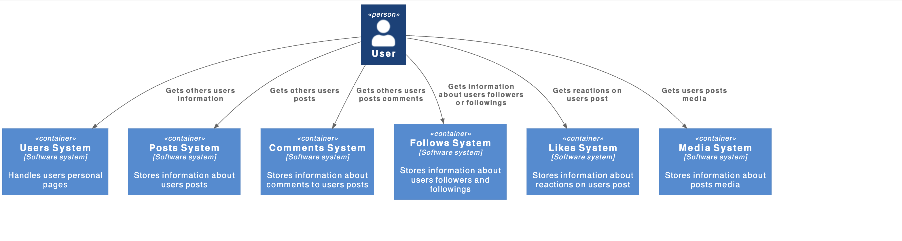
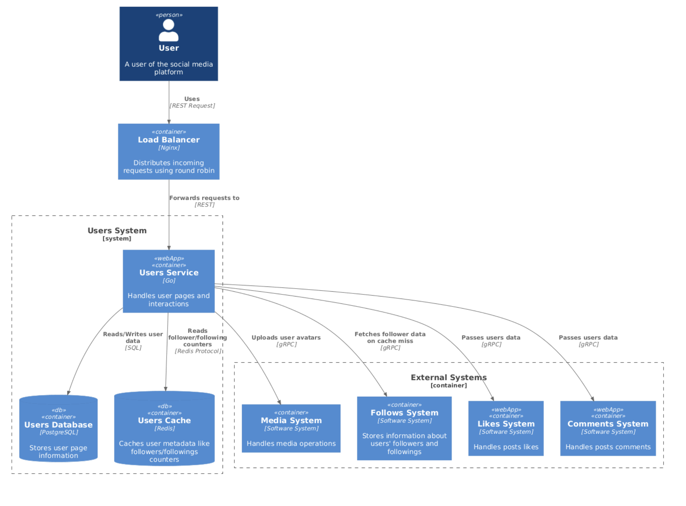
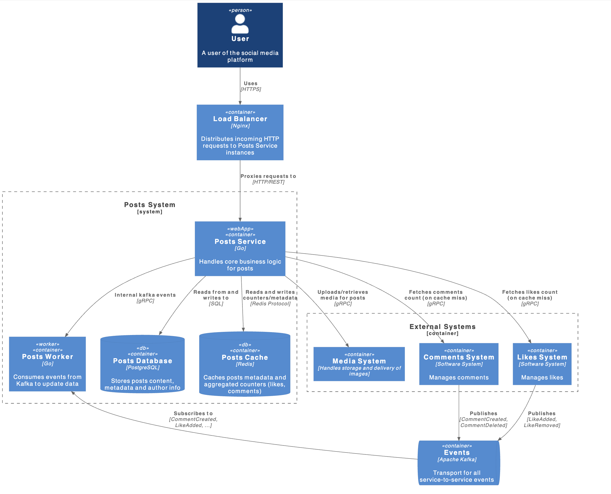
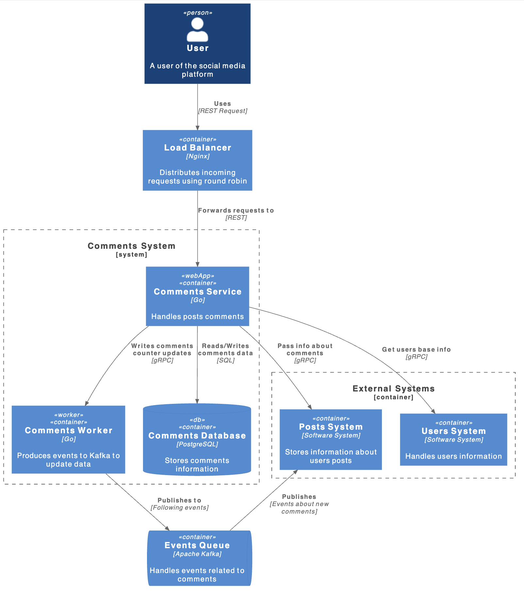
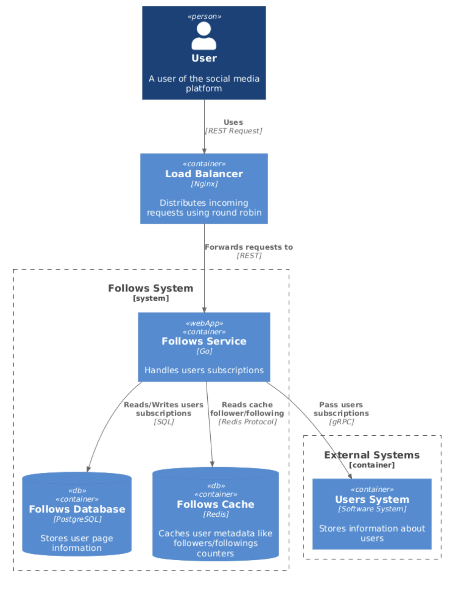
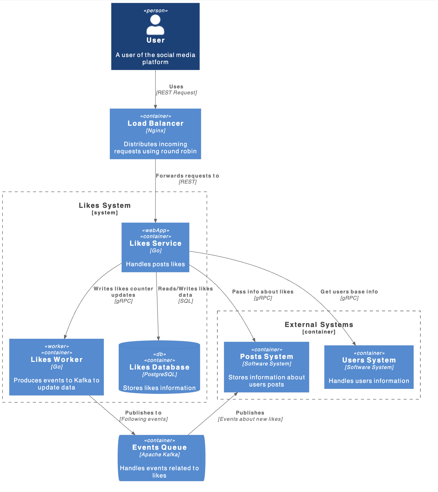

# social_network_system_design

## Функциональные требования

- Публикация постов
- Комментирование постов
- Реакции на посты других пользователей
- Подписки на других пользователей
- Поиск популярных мест для путешествий
- Просмотр ленты постов своих подписчиков
- Просмотр ленты другого пользователя

## Нефункциональные требования

- DAU 10.000.000
- Доступность 99.95%
- Данные храним всегда
- Сезонность есть: период отпусков и праздники, множитель на создание постов в 2 раза на этот период
- Аудитория: страны СНГ
- Активность пользователей:
    - пользователь в среднем делает 1 пост в две недели о своей поездке
    - пользователь в среднем комментирует по 2 поста в день
    - пользователь в среднем оценивает по 5 постов в день
    - пользователь делает по одной подписке в день
    - пользователь в среднем выполняет по 3 поиска в день
    - пользователь смотрит по 10 постов(вместе с 5 комментариями) других путешественников в день
- Лимиты
    - Один пост состоит из заголовка(до 100 символов), описания(до 1000 символов) и 1 фотографии(весом до 1 мб)
    - Один комментарий до 500 символов
    - Ограничение на подписки - 1000
- Тайминги
    - публикация поста 1-2с
    - комментарий к посту 1c
    - загрузка ленты до 5с
    - реакция на посты 800мс
- RPS
    - Подсистема постов
        - Read(просмотр постов): (10.000.000 * 10) / 86400 = 1157
        - Write(публикация постов): 10.000.000 / (86400 * 14) = 8
    - Подсистема комментариев и реакций
        - Write(комментирование чужих постов): (10.000.000 * 2) / 86400 = 231
        - Write(реакции на чужие посты): (10.000.000 * 5) / 86400 = 579
    - Поиск
        - Read(новые локации): (10.000.000 * 3) / 86400 = 347
- Трафик
- Один символ текста будет занимать 2Б
    - Подсистема постов:
      - Медиа
          - Создание поста: 8 * 1Мб(фото) = 8МБ/с
          - Чтение поста: 1157 * 1Мб(тоже фото) = 1Гб/с
      - Метаинформация:
          - Создание поста: 8 * (100 * 2Б + 1000*2Б + 50Б(метаданные)) = 18Кб/с
          - Чтение поста: 1157 * (100 * 2Б + 1000*2Б + 50Б(метаданные)) = 2,6Мб/с
    - Подсистема комментариев и реакций:
      - Комментирование чужих постов: 231 * (500 * 2Б) = 231Кб/с
      - Реакции на чужие посты: 579 * 8Б = 4,6Кб/с
    - Подсистема поиска:
        - Просмотр рекомендации: 347 * (200 * 2Б + 50Б) = 156Мб/с

## Архитектура проекта

     <b>Level 1.</b> System context diagram  

  

     <b>Level 2.</b> Users system container diagram  

 

  

     <b>Level 2.</b> Posts system container diagram  

 

  

     <b>Level 2.</b> Comments system container diagram  

 

  

     <b>Level 2.</b> Follows system container diagram  

 

  

     <b>Level 2.</b> Likes system container diagram  

 

  

     <b>Level 2.</b> Comments system container diagram  

 

  

## Оценка использования дисков

- Подсистема медиа
    - Capacity: 1ГБ/с * 86400 * 365 = 31536ТБ(HDD: 986; SSD-sata: 316; SSD-nVME: 1052)
    - IOPS: 1160(HDD: 12; SSD-sata: 2; SSD-nVME: 1)
    - Throughput: 1Гб/с (HDD: 10; SSD-sata: 2; SSD-nVME: 1)
    - Total: HDD - 986; SSD-sata - 316; SSD-nVME - 1052
- Подсистема постов
    - Capacity: 2,6Мб/с * 86400 * 365 = 82Тб(HDD: 3; SSD-sata: 1; SSD-nVME: 3)
    - IOPS: 1160(HDD: 12; SSD-sata: 2; SSD-nVME: 1)
    - Throughput: 2,6Мб/с (HDD: 1; SSD-sata: 1; SSD-nVME: 1)
    - Total: HDD - 12; SSD-sata - 2; SSD-nVME - 3
- Подсистема комментариев и реакций:
    - Capacity: 240Кб/с * 86400 * 365 = 8Тб(HDD: 1; SSD-sata: 1; SSD-nVME: 1)
    - IOPS: 810 (HDD: 9; SSD-sata: 1; SSD-nVME: 1)
    - Throughput: 240Кб/с (HDD: 1; SSD-sata: 1; SSD-nVME: 1)
    - Total: HDD - 9; SSD-sata - 1; SSD-nVME - 1

## Подсчёт хостов

- Подсистема медиа(SSD-sata):
    - Hosts = 316 / 2 = 158
    - Hosts_with_replication = 158 * 2 = 316
- Подсистема постов:
    - Hosts = 2 / 1 = 2
    - Hosts_with_replication = 2 * 3 = 6
- Подсистема комментариев и реакций:
    - Hosts = 1 / 1 = 1
    - Hosts_with_replication = 1 * 3 = 3
- Total: 325